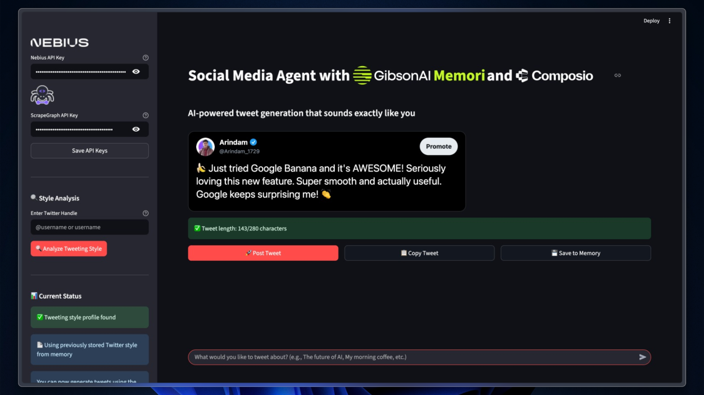

# Social Media Agent

A powerful AI-powered social media automation tool that analyzes your Twitter writing style, stores it in Memori, generates new tweets using Nebius AI and posts it using Composio. This application allows users to scrape their existing tweets, analyze their unique tweeting style, and generate new social media content that sounds exactly like them.

## Features ✨

🐦 **Twitter Style Analysis**: Scrape and analyze your tweeting patterns, tone, and personality
🤖 **AI-Powered Tweet Generation**: Uses Nebius AI to create content in your exact style  
💾 **Memory Integration**: Stores your tweeting style profile using Memori for long-term learning
🔍 **Smart Web Scraping**: Uses ScrapeGraph to extract your latest tweets automatically
🎯 **Style Matching**: Generates tweets that perfectly match your social media personality
📱 **One-Click Posting**: Direct integration with Twitter via Composio for seamless publishing
🔄 **Real-time Analysis**: Instant tweeting style insights with detailed breakdowns
⚙️ **Easy Configuration**: Simple setup with minimal API keys required
🔒 **Secure Processing**: Local tweet analysis with persistent memory storage

## Prerequisites 🛠️

- Python 3.10+
- Nebius AI API credentials
- ScrapeGraph (SGAI) API access
- Composio Twitter integration setup
- Twitter authentication via Composio

## Installation 📥

1. Clone the repository:

```bash
git clone https://github.com/firoz786/awesome-ai-apps.git
cd simple_ai_agents/social_media_agent
```

2. Install the required dependencies using uv:

```bash
uv sync
```

3. Create a `.env` file in the project root and add your API credentials:

```bash
# Nebius AI Configuration
NEBIUS_API_KEY=your_nebius_api_key

# ScrapeGraph Configuration
SGAI_API_KEY=your_scrapegraph_api_key

# Composio Twitter Integration
COMPOSIO_API_KEY=your_composio_api_key
TWITTER_AUTH_CONFIG_ID=your_twitter_auth_config_id
USER_ID=your_unique_user_identifier

# Optional: OpenAI (for fallback)
OPENAI_API_KEY=your_openai_api_key
```

## Usage 🚀

1. Start the Streamlit application:

```bash
uv run streamlit run app.py
```

2. Open your web browser and navigate to the provided local URL (typically `http://localhost:8501`)

3. Configure your API keys in the sidebar (Nebius and ScrapeGraph)

## How It Works 🔄

### 1. Style Analysis Agent (Sidebar)

- **Twitter Handle Input**: Enter any Twitter handle (including your own)
- **Tweet Scraping**: Automatically extracts the most popular 10 tweets using ScrapeGraph
- **Style Analysis**: Nebius AI analyzes tweeting patterns, tone, and personality
- **Memory Storage**: Automatically stores your style profile in Memori

### 2. Tweet Generation Agent (Main Area)

- **Topic Input**: Enter what you want to tweet about using the chat interface
- **Content Generation**: AI creates tweets using your stored tweeting style
- **One-Click Posting**: Directly post generated tweets to Twitter via Composio
- **Style Persistence**: Uses stored memory even after page refresh

## Example Workflow 🔄

1. **Enter Handle**: Input your Twitter handle (e.g., `@yourusername`)
2. **Analyze Style**: Click "🔍 Analyze Tweeting Style" to scrape and analyze
3. **Style Stored**: Your tweeting profile is automatically saved to memory
4. **Generate Tweets**: Use the chat input to request new tweets about any topic
5. **Post Content**: Generated tweets can be posted directly to Twitter
6. **Persistent Memory**: Your style remains available across sessions

## Tweet Style Analysis 📊

The AI analyzes your tweeting patterns across multiple dimensions:

- 🎭 **Tone**: Casual, professional, humorous, serious, etc.
- 🗣️ **Personality**: Friendly, authoritative, tech-savvy, etc.
- 🏗️ **Language Style**: Formal, informal, slang, technical jargon
- 🎨 **Emoji Usage**: Patterns and frequency of emoji use
- 📝 **Tweet Structure**: Length preferences and formatting patterns
- 🏷️ **Hashtag Patterns**: Common themes and hashtag usage
- 💬 **Common Phrases**: Recurring expressions and language patterns

## API Configuration 🔑

### Nebius AI

- **Model**: `zai-org/GLM-4.5-Air` (configurable)
- **Purpose**: Tweet generation and style analysis
- **Temperature**: 0.6 for balanced creativity

### ScrapeGraph (SGAI)

- **Purpose**: Twitter data extraction
- **Scope**: Latest 10 original tweets (no replies/retweets)
- **Format**: Structured JSON with tweet metadata

### Composio Twitter Integration

- **Purpose**: Direct tweet posting to Twitter
- **Authentication**: OAuth via Composio dashboard
- **Toolkit**: Full Twitter API access for posting

## Architecture 🏗️

### Modular Design

- **UI Layer** (`app.py`): Streamlit interface and user interactions
- **Agent Layer** (`twitter_agents.py`): AI functions and social media logic
- **Tool Layer** (`create_tweet.py`): Direct tweet creation utilities
- **Scraper Layer** (`scrapertool.py`): Web scraping functionality
- **Memory Layer**: Memori integration for style persistence

### Key Components

- **Tweet Scraper**: Extracts tweets using ScrapeGraph
- **Style Analyzer**: Analyzes tweeting patterns using Nebius AI
- **Tweet Generator**: Creates new content matching your style
- **Memory Manager**: Stores and retrieves tweeting style profiles
- **Twitter Poster**: Direct posting via Composio integration

## Example Use Cases 💡

### Content Creation

- "Write a tweet about the latest AI developments"
- "Create a thread about productivity tips"
- "Generate a tweet celebrating a milestone"
- "Tweet about a new project launch"

### Style Learning

- Analyze your personal Twitter account to learn your style
- Study influencer tweeting patterns for inspiration
- Build comprehensive profiles across different topics
- Refine your style profile over time with new content

### Automation Workflows

- Schedule content generation for consistent posting
- Maintain brand voice across team members
- Scale social media presence while preserving authenticity
- A/B test different tweeting styles

## Supported Features 📱

### Tweet Analysis

- ✅ Original tweets (authored content)
- ✅ Text content and metadata
- ✅ Timestamp and engagement data

### Content Generation

- ✅ Style-matched tweet creation
- ✅ Character limit compliance (<280 chars)
- ✅ Hashtag and emoji integration
- ✅ Topic-specific content
- ✅ Brand voice consistency

## Contributing 🤝

Contributions are welcome! Please feel free to submit a Pull Request.

1. Fork the repository
2. Create your feature branch (`git checkout -b feature/AmazingFeature`)
3. Commit your changes (`git commit -m 'Add some AmazingFeature'`)
4. Push to the branch (`git push origin feature/AmazingFeature`)
5. Open a Pull Request

## License 📄

This project is licensed under the MIT License - see the LICENSE file for details.

## Support 💬

If you encounter any issues or have questions, please open an issue on GitHub.
