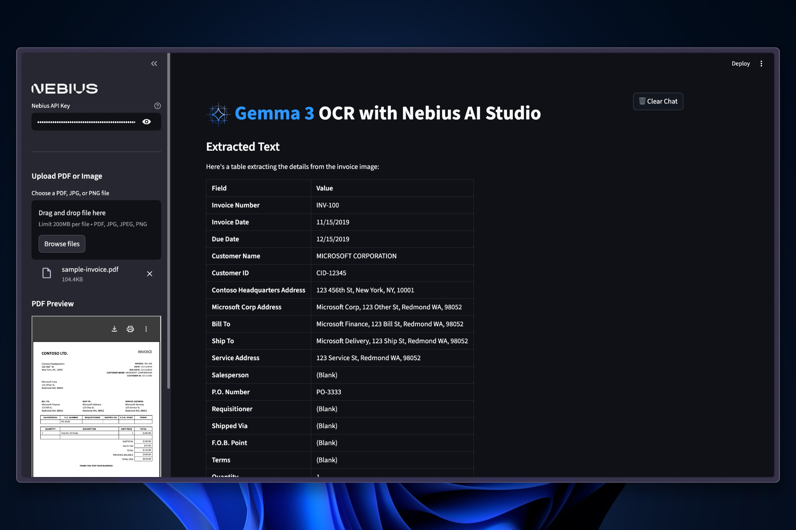

# Gemma 3 OCR Example

A fast OCR-based document and image processing app powered by Nebius AI Studio and Google’s Gemma 3 model. Upload PDFs or images and extract structured content using AI—displayed in real-time with an interactive UI.

## Features

* Upload PDFs or Images (JPG/PNG)
* OCR with `google/gemma-3-27b-it`
* Table-style Extraction for Structured Info
* Real-time Multi-page PDF Processing
* OpenAI-Compatible Nebius API Integration
* One-click Chat + State Reset
* Inline File Preview (PDF or Image)
* Streamlit-based UI

## Prerequisites

* Python 3.10+
* [Nebius AI Studio](https://studio.nebius.com/) Account
* [Nebius API Key](https://studio.nebius.com/?modals=create-api-key)
* `uv` installed (for dependency management):
  Install it globally:

  ```bash
  pip install uv
  ```

## Installation

1. Clone the repository:

```bash
git clone https://github.com/firoz786/awesome-ai-apps.git
cd rag_apps/gemma3_ocr
```

2. Install dependencies using [`uv`](https://github.com/astral-sh/uv):

```bash
uv sync
```

3. Set up environment variables:
   Create a `.env` file in the project root:

```env
NEBIUS_API_KEY=your_api_key_here
```

## Usage

Start the Streamlit application:

```bash
uv run streamlit run main.py
```

Then open your browser at: [http://localhost:8501](http://localhost:8501)




## How It Works

### Upload & Preview

* Sidebar lets you upload a PDF or image (JPG/PNG).
* Inline preview for visual feedback before processing.

### OCR Processing

* PDFs are split into pages and each page is converted to an image.
* Images are passed to the Nebius Chat Completion API via the OpenAI-compatible client.
* Responses with structured data are displayed in the app.

### Model Used

* Model: `google/gemma-3-27b-it` via Nebius
* Input: Base64 image
* Output: Extracted text, often structured in tables

## Architecture

* Frontend: Streamlit
* OCR Backend: Nebius API with Gemma 3
* PDF Parsing: PyMuPDF (`fitz`)
* Env Handling: `dotenv`
* Dependencies: Managed via [`uv`](https://github.com/astral-sh/uv)

## Contributing

Found a bug or want to improve the app?
Open an issue or submit a pull request.
